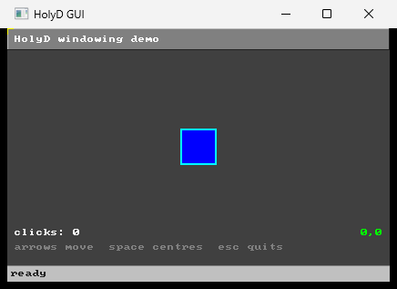

# HolyD

A HolyC-flavoured language with a D accent, and a bytecode VM to run it.
Originally the scripting language for [TOS](../TOS); this repository is the
standalone build, which opens real windows.

```
make
./holyd.exe samples/gui.hd
```



## What it is

A lexer, parser, AST, bytecode compiler and VM in about 2,300 lines of C,
plus an FFI that gives scripts windows, drawing, input and UDP sockets. It
runs the same `.hd` file on Windows and on TOS, unchanged.

```c
I64 win = WinCreate(420, 260, "HolyD GUI", WIN_STATUSBAR);

while (running == 1) {
    I64 ev = WinPollEvent(win);
    while (ev != EV_NONE) {
        if (ev == EV_KEY_DOWN && WinEventKey() == KEY_ESC) running = 0;
        ev = WinPollEvent(win);
    }

    WinClear(win, COLOR_DARK_GRAY);
    WinFillRect(win, bx, by, 40, 40, COLOR_BLUE);
    WinDrawText(win, 8, 8, "clicks: " ~ Str(clicks), COLOR_WHITE, 1);
    WinInvalidate(win);
    Sleep(16);
}
```

`samples/gui.hd` is the real thing, and predates `&&`, so it spells that
condition as a nested `if`.

## Building

Windows, with MSYS2 or any MinGW-w64 gcc:

| | |
|---|---|
| `make` | build `holyd.exe` |
| `make test` | run every script in `tests/` |
| `make gui` | build and open the windowing sample |

There are no dependencies beyond the C runtime and three system libraries:
`gdi32` for the DIB section a window draws into, `user32` for the window
itself, `ws2_32` for `UdpSocket`.

## Using it

```
holyd <source.hd>          run a script
holyd --test [dir]         run every .hd under dir (default holyd/tests/)
holyd -tokens <source.hd>  print the token stream
holyd --dump-symbols ...   print resolved names and frame slots
holyd --dump-types ...     print inferred symbol and expression types
holyd --dump-bytecode ...  disassemble before running
holyd --interpret ...      walk the AST instead of running bytecode
holyd --emit-c <source.hd> translate to C instead of running it
holyd --emit-asm <source.hd>  translate to x86-64 assembly instead
holyd --emit-c ... -o out.c   where to write it
holyd --emit-pe <source.hd>   write a direct standalone PE executable
holyd -run <source.hd>        build and run the direct PE subset
holyd --help
```

`--interpret` has no FFI: the tree walker predates it, so the `Win*` and
`Udp*` natives resolve only under the bytecode VM. It refuses `goto` for the
same reason , it runs the AST by recursion, so a jump would have to unwind
out of every enclosing node and then find its way back in.

## Compiling to an executable

`--emit-c` writes a C translation unit that links against the same runtime
the VM uses, which gives you a real `.exe` that no longer needs `holyd`:

```
make compile HD=samples/gui.hd
```

That writes `build/gui.c` and `build/gui.exe`. The name comes from the
script; `OUT=` overrides it, and `make run HD=...` builds and then runs.

| | |
|---|---|
| `make compile HD=tests/hello.hd` | `build/hello.exe` |
| `make compile HD=samples/gui.hd OUT=gui.exe` | `gui.exe` |
| `make run HD=tests/hello.hd` | build it, then run it |

The generated C is kept rather than deleted: it is the thing to read when
the backend does something surprising. By hand, the same build is

```
holyd --emit-c samples/gui.hd -o gui.c
gcc -std=gnu11 -O2 -I src gui.c \
    src/runtime.c src/eval.c src/ffi.c src/ffi_win32.c \
    src/platform/standalone/gfx.c src/platform/standalone/bmp.c \
    -o gui.exe -lgdi32 -luser32 -lws2_32
```

For the usual one-command path, use the assembly backend and let Holyd invoke
the host assembler/linker itself:

```
holyd --emit-exe tests/hello.hd -o hello.exe
```

`--emit-exe` creates only the executable; its intermediate assembly is removed
after the toolchain returns. It defaults to replacing `.hd` with `.exe`, and
`HOLYD_CC` can name a different GCC-compatible host toolchain. It currently
targets the standalone Windows build, links the same runtime as `make compile`,
and is not yet a hand-written PE writer.

### Direct PE output: first standalone milestone

`--emit-pe` is the separate no-toolchain path. It writes a PE/x64 image itself
and imports only `KERNEL32!ExitProcess`; it does not generate C or assembly,
invoke an assembler/linker, or link the C runtime.

```
holyd --emit-pe samples/direct_pe_exit.hd -o direct-pe.exe
```

This first vertical slice intentionally accepts only a parameterless `main` or
`Main` containing a single `return` of an integer constant expression. It is a
real executable—the sample exits with status 42—but not a replacement for the
VM or host-linker backend yet. Variables, calls, I/O, arrays, strings, and FFI
will arrive with the native runtime milestones.

`-run` is the convenience form for this same direct backend. It creates a
private executable next to the source, runs it, removes it afterwards, and
returns the child program's exit status. It does not accept `-o` because it
never leaves an output artifact behind.

Control flow becomes real C control flow, calls become direct C calls, and
each name becomes a C local or a file-scope static. The semantic type pass
lets representation-stable integers, booleans, and doubles use native C
storage and direct `+`, `-`, `*`, comparison, unary-minus, and compatible
ternary expressions. Dynamic or representation-ambiguous values remain boxed
`HDValue`s. Explicit boxing at runtime and FFI boundaries is what keeps this
optimization diff-testable against the VM; see `docs/roadmap.md` §10.

A name becoming a C variable does not make it a C *scope*. HolyD scopes
variables to the function, and a declaration takes effect where it is
written: until it runs, the name still means whatever the enclosing scope
makes of it. So each variable is emitted with a bit saying whether it is
bound yet, and reading one walks the chain the resolver recorded , this
frame, then a global of the same name, then the `Environment`, which is
where the FFI constants live and where an undefined name is finally an
error. `tests/resolution.hd` is that behaviour written out, and `difftest`
holds both paths to it. Hoisting the declarations instead would have been
simpler and wrong.

## Compiling through assembly

`--emit-asm` is the same translation one level lower: x86-64 in GNU
assembler syntax, Win64 calling convention, linking the same runtime.

```
make compile HD=tests/hello.hd BACKEND=asm
```

It exists to be the step before emitting machine code directly. Everything
an object-file writer would need in front of it , instruction selection,
frame layout, the struct-passing rules , is here and is checked against the
VM, so what a later `--emit-exe` adds is an encoder and a PE or ELF writer
rather than a whole code generator.

It is not the faster backend. Every value is still a boxed 56-byte
`HDValue` and every operator is still a call into the runtime, so an add
costs an add's worth of argument marshalling either way, and `gcc -O2` beats
this comfortably by keeping things in registers around those calls. Speed is
what a type system buys, not what dropping the C compiler buys ,
`docs/roadmap.md` §10.

What makes it tractable is that `HDValue` is 56 bytes. Both Win64 and SysV
pass anything over 16 bytes in memory and return it through a hidden
pointer, so every value travels as an address and none of the register
classification a smaller struct would need ever comes up.

```
make difftest       the C backend against the VM
make difftest-asm   the assembly backend against the VM
make difftest-all   both
```

`make difftest` runs every script in `tests/` twice, once on the VM and once
compiled, and fails if the two disagree on stdout or on exit status. The VM
is the oracle; run it after touching `src/runtime.c`, `src/emit_c.c` or
`src/emit_asm.c`. Running both backends is what tells a codegen bug apart
from a runtime one.

## Examples

Everything in `tests/` finishes on its own and is checked by both execution
paths, so they double as the worked examples. Read them in roughly this
order:

| | |
|---|---|
| `tests/hello.hd` | printing, globals |
| `tests/fizzbuzz.hd` | `else if` chains, `%`, and truncating division |
| `tests/operators.hd` | arithmetic, bitwise, shifts, `^^`, `!`, and short-circuiting made visible |
| `tests/control_flow.hd` | what to write where `break`, `continue`, `switch` and `do`/`while` would go |
| `tests/goto.hd` | labels and `goto`, including out of nested loops and into a loop body |
| `tests/recursion.hd` | recursion, mutual recursion, declaration order |
| `tests/sorting.hd` | arrays in place, and that a passed array aliases the caller's |
| `tests/life_text.hd` | a 2D grid in a flat array, and Life's rules checked against known patterns |

`samples/` needs a person or a network:

| | |
|---|---|
| `samples/gui.hd` | the windowing FFI end to end |
| `samples/window.hd` | the smallest window that draws something |
| `samples/life.hd` | `life_text.hd` again, drawn , space pauses, `r` reseeds, `s` steps |
| `samples/net.hd` | UDP |

`tests/control_flow.hd` is the one to read first if the missing statements
are making the language feel smaller than it is.

## Layout

```
src/            the language, and the natives
  runtime.c       what a HolyD value is and what the operators do. Shared:
                  the VM and transpiled C both run on this, so there is one
                  definition of each operator rather than two.
  resolve.c       what each name means , one symbol per declaration, one
                  slot per frame, and the fallback chain a name follows
                  before its declaration runs. Shared by both backends.
  emit_c.c        the C backend , AST to a C translation unit.
  emit_asm.c      the assembly backend , AST to x86-64, Win64 ABI. Same
                  runtime and same resolver as emit_c.c, one level lower.
  ffi.c           every native a script can call. Portable: the drawing
                  calls only ever touch a gfx_surface.
  ffi_platform.h  what a host has to provide , about fourteen functions
  ffi_win32.c     CreateWindowEx over a top-down DIB section
  ffi_tos.c       the other host: winman over IPC. Built inside the TOS
                  tree, not here.
  platform/       adapters for gfx, BMP, keycodes, and font8x8
    standalone/   HolyD-owned implementations used away from TOS
samples/        scripts that open a window or wait on the network
tests/          scripts that finish on their own , what --test runs
tools/difftest.sh  runs tests/ on both paths and diffs them
docs/roadmap.md what the language is still missing
```

The reason one `ffi.c` serves both hosts is that `lib/gfx.c` is pure
arithmetic over a pixel buffer with no system calls in it. winman hands a
client a raw BGRA buffer; a DIB section is also a raw BGRA buffer. So the
drawing natives never needed porting , only window creation, input, sleeping
and sockets did, and those are `ffi_platform.h`.

## Relationship to TOS

**This repository is upstream.** TOS consumes it as a submodule at
`userspace/bin/holyd`, and builds `src/` into the OS image with `ffi_tos.c`
as the host. Changing the language means committing here, then bumping the
pointer in TOS:

```
# after committing and pushing the HolyD checkout, in the TOS tree
git -C userspace/bin/holyd fetch origin
git -C userspace/bin/holyd checkout <new-holyd-commit>
git add userspace/bin/holyd && git commit -m "holyd: bump"
```

TOS's samples on the image come from `samples/` and `tests/` here, so those
have one home too. There is no reverse source sync.

The headers under `src/platform/` make the graphics boundary explicit. TOS
builds HolyD with `HOLYD_TARGET_TOS=1`, so the adapters use TOS's public
`gfx`, `bmp`, `key_codes`, and `font8x8` headers and the executable links
their implementations from `libtos`. A standalone build leaves that macro
unset and selects the compatible implementations under
`src/platform/standalone/` instead. Those fallbacks belong to HolyD; they are
not refreshed by copying files out of TOS.

Because it is a submodule, a fresh TOS clone needs the extra step:

```
git clone --recursive https://github.com/CodeByRiley/TOS.git
# or, in an existing clone
git submodule update --init
```

## Language

HolyC with D borrowings, and unfinished in ways worth knowing before writing
much:

- `~` joins strings. `Str()` turns an I64 into one; there is no other way.
- `goto` and labels work. A label is declared `.name:` and jumped to with
  `goto name;` or `goto .name;`. A label belongs to the function that
  declares it, and a jump may land anywhere in that function, including
  inside a loop body. It may not land inside a `foreach` body it is not
  already in, because that lowering declares a loop counter on entry.
  Leaving two loops at once is what it is mostly for.
- No `break`, `continue`, `switch`, or `do`/`while`. `&&`, `||`, `!`, `%`,
  the bitwise and shift operators, `^^`, and the compound assignments all
  work; `tests/operators.hd` is the tour.
- `else if` and brace-less bodies do work. So do hex literals and floats.
- `main()` runs on its own unless the top level already calls it. A `main`
  that declares parameters is never called automatically.
- No structs. That is why `WinPollEvent` returns a code and the rest of the
  event is read back through `WinEventKey()`, `WinEventX()` and friends.
- Classes execute through the C backend: `make compile HD=samples/class_syntax.hd`
  lowers them to heap-allocated C structs. Fields, `this.field`,
  `object.field`, receiver methods, D-style `this(...)` constructors,
  class-name constructors, and inherited fields/methods work. A derived class
  with no constructor forwards a matching constructor call to its base as a
  temporary convenience. Bytecode, assembly, direct-PE, and interpreter
  backends still reject class programs rather than silently skipping them.

`docs/roadmap.md` is the full list of what is missing, roughly in the order
it is worth adding.

## Natives

Windows: `WinCreate` `WinDestroy` `WinSetTitle` `WinSetStatus` `WinInvalidate`
`WinPresent` `WinWidth` `WinHeight` `WinPrompt` `WinPromptText`

Drawing: `WinClear` `WinFillRect` `WinDrawRect` `WinBevel` `WinDrawPixel`
`WinHLine` `WinVLine` `WinDrawText` `WinTextWidth`

Events: `WinPollEvent` `WinEventKey` `WinEventX` `WinEventY` `WinEventW`
`WinEventH`

Other: `Str` `Rgb` `Sleep` `Yield` `UdpSocket` `UdpBind` `UdpSend`
`UdpReceive`

Constants arrive as ordinary globals, because the language has no enums:
`EV_*`, `KEY_*`, `COLOR_*`, `MOUSE_*`, `PROMPT_*`, `WIN_STATUSBAR`.
